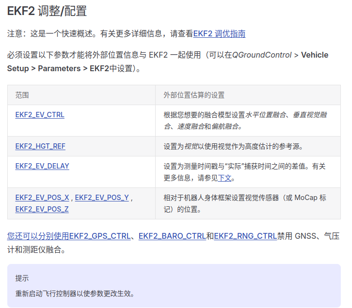

# MoCap To do list

## 1. PX4 Setup

[PX4 External Position Estimation](https://docs.px4.io/main/zh/ros/external_position_estimation.html)




## 2. How to do

ROS1: 订阅动捕的消息 `/vrpn_client_node/<rigid_body_name>/pose`，类型为`geometry_msgs/PoseStamped` ，并通过 UDP 转发给ROS2 程序。

ROS2: 接收 UDP 动捕的消息，并

1. 转成 `vehicle_visual_odometry` ORB 消息，通过 dds 发布给 PX4。

2. 转成 `FollowerSend` ROS2 消息，通过 dds 发布给 Leader。

Compile ros1_ws with docker:

```
# create our own image
sudo docker build -t vm_ros1 $PWD/src/mqsls/src/utils/

# run with folder mapping
sudo docker run -it -v $PWD/src/mqsls/src/utils/ros1_ws:/root/ros1_ws vm_ros1
```